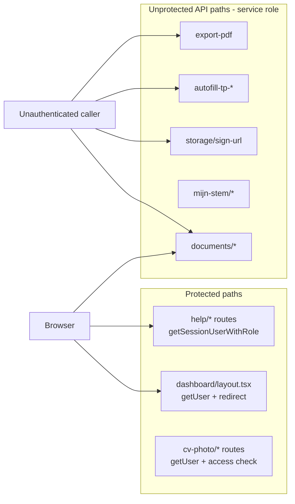

# Security Audit Report — vat-app-copy

**Audit date:** 2026-07-05  
**Branch:** `security/audit-2026-07`  
**Scope:** Full baseline per [`AUDIT_SCOPE.md`](AUDIT_SCOPE.md) — 72 API routes, Supabase migrations, auth flows, CV share, uploads, OpenAI, PDF export, XSS, infrastructure checklist.

---

## Executive summary

| Severity | Count |
|----------|-------|
| Critical | 22 |
| High | 12 |
| Medium | 23 |
| Low | 8 |
| Info (positive) | 8 |

**Top risks:** Multiple API routes use the Supabase **service role without any authentication**, allowing unauthenticated read/write/delete of employee documents, storage objects, TP/medical autofill data, and Mijn Stem user content. The `documents` API and `storage/sign-url` are the most immediately exploitable. There is **no global `middleware.ts`** and **no security headers** in `next.config.ts`. Database-level gaps include missing RLS on `public.documents` and `public.users`.

**Positive findings:** CV share module uses strong token hashing and HMAC sessions; help admin routes and invite-user are properly admin-gated; service role key is not exposed in client bundles; no hardcoded secrets found in source.

---

## Architecture: auth flow gaps

Dashboard pages enforce auth at the layout level, but **API routes are independently callable** without session checks. Client-side Supabase queries rely on RLS, but server routes bypass RLS via service role.

---

## Route inventory (72 handlers)

| Classification | Count | Examples |
|----------------|-------|----------|
| Authenticated | ~20 | `help/*`, `cv-photo/*`, `autofill-cv`, `signup/finalize` |
| Admin-only | 11 | `help/admin/*`, `invite-user` |
| Public-by-design | 8 | `cv-share/[token]/*`, `health-check`, `complete-signup` (410) |
| **Unauthenticated (broken)** | **~33** | `documents/*`, `storage/sign-url`, all `autofill-tp-*`, all `mijn-stem/*`, `export-pdf`, `export-cv-pdf`, `check-schema` |

*Route counts are directional; ~33 routes have explicit session checks including guest-token CV-share routes.*

---

## Findings (severity-sorted)

| Severity | Location (file:line) | Finding |
|----------|----------------------|---------|
| Critical | `src/app/api/documents/get/route.ts:5` | Unauthenticated POST lists all documents for any `employee_id` via `supabaseAdmin` |
| Critical | `src/app/api/documents/upload/route.ts:6` | Unauthenticated POST uploads files to storage for any `employee_id`; no MIME/size validation |
| Critical | `src/app/api/documents/delete/route.ts:5` | Unauthenticated POST deletes storage objects and DB rows via service role |
| Critical | `src/app/api/documents/metadata/route.ts:6` | Unauthenticated POST inserts document metadata via service role |
| Critical | `src/app/api/storage/sign-url/route.ts:21` | Unauthenticated POST mints 1-hour signed URLs for any path in `documents` bucket |
| Critical | `src/app/api/export-pdf/route.tsx:114` | Reads session but never returns 401; exports full TP/VGR PDF for any `employeeId` via service role |
| Critical | `src/app/tp/print/page.tsx:32` | Session read but not enforced; loads full TP data via service role for any caller; accepts arbitrary `?u=` user id |
| Critical | `src/app/api/autofill-tp-2/route.ts:127` | Unauthenticated GET autofill + OpenAI + DB writes for any `employeeId` (same on all 14 `autofill-tp-3/*` routes) |
| Critical | `src/app/api/autofill-employee-info-working/route.ts:304` | Unauthenticated GET employee autofill via service role |
| Critical | `src/app/api/mijn-stem/upload/route.ts:8` | Unauthenticated POST with client-supplied `userId`; upload + DB insert via service role (IDOR) |
| Critical | `src/app/api/mijn-stem/analyze/route.ts:8` | Unauthenticated POST analyzes any `documentId` via service role (IDOR) |
| Critical | `src/app/api/mijn-stem/rewrite/route.ts:9` | Unauthenticated POST for any `userId` via service role (IDOR) |
| Critical | `src/app/api/mijn-stem/style/route.ts:7` | Unauthenticated GET writing-style profile for any `userId` (IDOR) |
| Critical | `src/app/api/mijn-stem/upload/route.ts:95` | Unauthenticated GET lists documents for any `userId` (IDOR) |
| Critical | `src/app/api/mijn-stem/init/route.ts:7` | Unauthenticated POST runs DDL/RLS/bucket setup via service role + `exec_sql` RPC |
| Critical | `src/app/api/mijn-stem/setup/route.ts:7` | Unauthenticated POST/GET infrastructure setup via service role |
| Critical | `src/app/api/mijn-stem/create-bucket/route.ts:7` | Unauthenticated POST creates storage bucket via service role |
| Critical | `src/app/api/check-schema/route.ts:9` | Unauthenticated GET probes DB schema via service role; returns sample columns |
| Critical | `supabase/migrations/` (no file) | `public.documents` table has no RLS in any migration |
| Critical | `supabase/migrations/` (no file) | `public.users` table has no RLS in any migration |
| Critical | `supabase/migrations/` (no file) | `documents` storage bucket has no `storage.objects` policies in migrations |
| Critical | `src/app/api/mijn-stem/init/route.ts:66` | Calls `rpc/exec_sql` with DDL; RPC not defined in repo migrations — verify production grants |
| High | `src/app/api/export-cv-pdf/route.tsx:94` | Reads session but never returns 401; unauthenticated Puppeteer export possible |
| High | `src/app/api/mijn-stem/delete/route.ts:7` | DELETE trusts client `userId` query param; no session binding |
| High | `src/app/api/autofill-tp-3/prognose/route.ts:30` | GET uses `SupabaseService` (service role) + OpenAI; no auth |
| High | `src/app/api/storage/delete/route.ts:36` | Session-only check; no path/employee ownership before service-role delete |
| High | `src/app/api/signup/finalize/route.ts:41` | Role falls back to `user.user_metadata.role` when no DB row — potential admin escalation |
| High | `src/app/api/help/kb-media/sign-url/route.ts:18` | Any authenticated user can sign URLs for arbitrary `kb-media` paths (IDOR) |
| High | `supabase/migrations/20260619120000_open_access_model.sql:66` | `user_has_employee_access()` returns true for any authenticated user |
| High | `supabase/migrations/20260619120000_open_access_model.sql:138` | `cv-photos` policies allow any authenticated user full bucket access |
| High | `add_employees_rls_policies.sql:20` | `is_admin()` reads `users.role`; without RLS on `users`, role self-elevation grants admin |
| High | `src/app/api/autofill-tp-2/route.ts:204` | `console.log` dumps full extracted TP2 data (PII) to server logs |
| High | `src/app/api/autofill-employee-info-working/route.ts:137` | `console.log` dumps work experience PII to server logs |
| High | `package.json` (npm audit) | 67 dependency vulnerabilities (7 critical, 25 high); includes Next.js, nodemailer, fast-xml-parser |
| Medium | `next.config.ts:1` | No security headers (CSP, HSTS, X-Frame-Options, Referrer-Policy) |
| Medium | (no file) | No root `middleware.ts` — no centralized API auth or rate limiting |
| Medium | `src/lib/cv-share/rate-limit.ts:5` | In-memory rate limiter ineffective across serverless instances |
| Medium | `src/app/dashboard/help/page.tsx:168` | `dangerouslySetInnerHTML` on KB search headlines from `ts_headline()` on `kb_articles.body` — HTML/script in admin-authored body can execute in search snippets |
| Medium | `src/components/tp/RichTextEditor.tsx:254` | `innerHTML` assignment without HTML escaping; autofill/paste can inject scripts |
| Medium | `src/app/api/cv-share/[token]/verify/route.ts:40` | Email verification is knowledge-only (no OTP); token + email sufficient for write session |
| Medium | `src/app/api/cv-share/[token]/export-pdf/route.tsx:62` | No rate limiting on expensive headless Chrome PDF export |
| Medium | `src/app/api/health-check/route.ts:7` | Public endpoint leaks env-var presence (service key, OpenAI key configured) |
| Medium | `src/app/api/mijn-stem/test/route.ts:7` | Unauthenticated diagnostic endpoint using service role |
| Medium | `src/app/api/check-schema/route.ts:61` | 500 responses include `error.stack` |
| Medium | `supabase/migrations/20260619120000_open_access_model.sql:1` | Open-access migration incomplete — `employees_*` policies still assignment-scoped while child tables are open |
| Medium | `supabase/migrations/` (no file) | `tp_meta`, `tp_docs`, `user_clients` have no RLS in migrations |
| Medium | `src/app/api/export-pdf/route.tsx:130` | VGR branch validates instance id only; no caller authorization |
| Medium | `src/app/api/autofill-cv/route.ts:93` | Auth required; CV loaded via session client (RLS applies) but open-access model allows any authenticated advisor to access any CV — tenant isolation gap |
| Medium | `src/app/debug-user/page.tsx:57` | Any authenticated user can self-whitelist via `users` upsert (`status: confirmed`); bypasses invite-only login gate when `users` RLS is absent |
| Medium | `src/app/api/export-pdf/route.tsx:85` | Unauthenticated callers can trigger headless Chrome + service-role data load; no rate limiting (resource abuse / cost amplification) |
| Medium | `src/app/api/export-cv-pdf/route.tsx:67` | Unauthenticated callers launch Puppeteer even though `/cv/print` requires auth; no rate limiting |
| Medium | `src/app/vgr/print/page.tsx:1` | No explicit session enforcement; relies on RLS only (defense-in-depth gap vs `cv/print` pattern) |
| Medium | `src/app/tp2026/print/page.tsx:1` | No explicit session enforcement; relies on RLS only (defense-in-depth gap vs `cv/print` pattern) |
| Medium | `src/app/api/cv-share/[token]/document/route.ts:107` | Guest PATCH stores raw `payload_json` without server-side validation |
| Medium | `src/app/api/cv-share/[token]/photo/upload/route.ts:40` | MIME type trust is client-supplied only; no magic-byte validation |
| Medium | `src/app/api/mijn-stem/init/route.ts:85` | Error responses return full DDL `sqlScript` to client |
| Medium | `src/app/api/autofill-employee-info-working/route.ts:374` | Logs referent first/last names (PII) |
| Low | `src/app/api/cv-share/[token]/verify/route.ts:23` | Rate-limit key uses spoofable `x-forwarded-for` |
| Low | `src/lib/cv-share/session.ts:77` | Session cookie scoped to `Path=/` (not share-specific) |
| Low | `src/lib/cv-share/base-url.ts:3` | Trusts `x-forwarded-proto`/`x-forwarded-host` for share URLs |
| Low | `src/app/api/cv-share/[token]/export-pdf/route.tsx:151` | 500 responses include `detail: err.message` |
| Low | `src/lib/tp/load.ts:115` | Logs full consultant user row including email/phone |
| Low | `src/app/api/export-cv-pdf/route.tsx:67` | Indirect protection via `/cv/print` auth; API itself lacks explicit 401 |
| Low | `supabase/migrations/create_mijn_stem_table.sql:27` | RLS policy lacks explicit `TO authenticated` |
| Low | `src/app/api/complete-signup/route.ts:3` | Deprecated 410 endpoint (no data exposure) |
| Info | `src/lib/cv-share/tokens.ts:3` | Share tokens: 32-byte random, SHA-256 hash stored (good) |
| Info | `src/lib/cv-share/session.ts:23` | HMAC-SHA256 sessions with timingSafeEqual (good) |
| Info | `src/lib/cv-share/access.ts:77` | validateGuestAccess binds session to shareId/cvId/employeeId/email (good) |
| Info | `src/app/api/invite-user/route.ts:28` | Admin-gated invite flow (good) |
| Info | `src/app/api/cv-photo/upload/route.ts:15` | Reference implementation: auth + access + MIME + size + path validation |
| Info | `src/` client code | Service role not exposed in client bundles (good) |
| Info | `supabase/migrations/20260401120000_help_center_kb_tickets.sql:211` | Support ticket RLS enforces ownership (good) |
| Info | `src/lib/cv-share/email.ts:233` | Share email HTML uses escapeHtml (good) |

---

## Automated checks summary

| Check | Result |
|-------|--------|
| Secret scan (`sk-`, hardcoded keys) | **Pass** — no matches in `src/` |
| npm audit (moderate+) | **Fail** — 67 vulnerabilities (7 critical, 25 high, 32 moderate) |
| Auth route inventory | **Fail** — 33/72 routes unauthenticated with service role |
| XSS sink grep | **2 locations** — help page + RichTextEditor |
| middleware.ts | **Missing** |
| security headers in next.config.ts | **Missing** |

---

## False positives / accepted risks (confirm with product owner)

| Item | Notes |
|------|-------|
| Open-access RLS model | If intentional that all authenticated advisors see all employees/clients, document as accepted risk. If not, this is a P0 authorization regression. |
| CV share email-only verification | Acceptable if share links are treated as capability URLs sent to trusted recipients. |
| OpenAI document processing | Sending employee medical/intake PDFs to OpenAI may be required for autofill — confirm data processing agreement compliance. |

---

## Remediation priority

### P0 — Block before production exposure
1. Add authentication + authorization to all service-role routes: `documents/*`, `storage/sign-url`, `autofill-tp-*`, `mijn-stem/*`, `export-pdf`, `export-cv-pdf`
2. Add auth gate to `tp/print/page.tsx` before `loadTPData`
3. Remove or protect debug/setup endpoints (`check-schema`, `health-check`, `mijn-stem/test|init|setup|create-bucket`, `/debug-user`)
4. Verify/remove `exec_sql` RPC in Supabase production

### P1 — Next sprint
5. Add RLS migrations for `users`, `documents`, `tp_meta`, and `documents` storage bucket policies
6. Fix signup role assignment — never trust `user_metadata.role`; default to `"user"`
7. Revisit open-access RLS model for employee/client isolation
8. Add security headers and root `middleware.ts` for `/api/*` and `/dashboard/*`
9. Run `npm audit fix`; upgrade Next.js and nodemailer

### P2 — Hardening
10. Replace in-memory CV share rate limiter with Redis/Upstash
11. Sanitize KB search headlines and RichTextEditor HTML
12. Remove PII from server logs in autofill routes
13. Add rate limits on CV share PDF export and guest write endpoints

---

## Related documents

- [`AUDIT_SCOPE.md`](AUDIT_SCOPE.md) — audit trigger and scope manifest
- [`INFRA_CHECKLIST.md`](INFRA_CHECKLIST.md) — Supabase/Vercel manual verification checklist

---

## Audit methodology

1. Cursor `review-security` subagent (full-repo baseline with branch diff trigger)
2. Automated: `npm audit`, secret scan, route auth inventory, XSS grep
3. Four parallel domain reviews: API auth, Supabase RLS, CV share, XSS/uploads/AI
4. Infrastructure checklist (code review + manual VERIFY items)
5. Validation pass via second security-review subagent on audit branch diff (corrections applied per validation feedback)

**No code fixes were applied during this audit.** Remediation is a separate follow-up PR series; each fix PR should re-run `/review-security`.

---

## Validation pass result

Second security-review subagent reviewed audit deliverables vs live codebase. **Substance validated** (critical findings confirmed). **Corrections applied:** severity count fix, duplicate row removal, wording updates for `tp/print`/help XSS/`autofill-cv`, and three additional medium findings (`debug-user`, export Puppeteer abuse, print route defense-in-depth). Remaining **VERIFY** items require Supabase/Vercel dashboard completion per [`INFRA_CHECKLIST.md`](INFRA_CHECKLIST.md).
